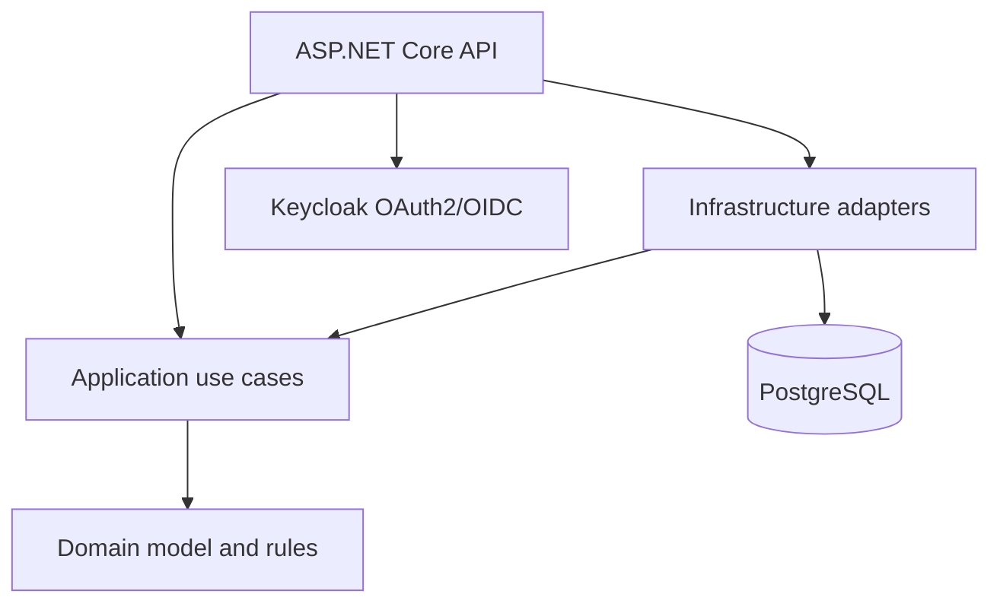
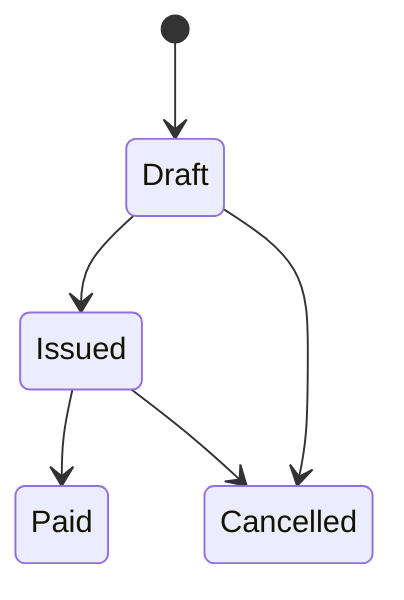

# InvoiceFlow API

A portfolio-grade invoice management API built with **ASP.NET Core 10**, Entity
Framework Core, PostgreSQL, OAuth 2.0/OpenID Connect and Docker. It demonstrates
practical backend engineering: explicit domain rules, country-aware VAT calculation,
optimistic concurrency, secure resource ownership, database migrations, PDF output,
integration tests and CI.

> **Important:** this is a technical demonstration, not certified accounting software
> or tax advice. VAT applicability depends on the product, customer, place of supply,
> registration status and local rules. Validate tax behavior before real-world use.

## What it demonstrates

- RESTful `GET`, `POST`, `PUT`, `PATCH` and `DELETE` endpoints
- Clean separation between Domain, Application, Infrastructure and API layers
- EF Core with PostgreSQL, migrations and effective-dated VAT records
- OAuth 2.0 Client Credentials flow through Keycloak
- role-based authorization with `invoice.read` and `invoice.write`
- owner isolation based on the authenticated token's `sub` claim
- invoice lifecycle: `Draft → Issued → Paid`, plus cancellation rules
- immutable issued invoices and server-generated invoice numbers
- `ETag` / `If-Match` optimistic concurrency for writes
- RFC 7807 Problem Details and model validation
- pagination and filtering
- PDF invoice generation with QuestPDF
- health checks and per-user/IP rate limiting
- unit tests and real PostgreSQL integration tests with Testcontainers
- Docker Compose, GitHub Actions and Dependabot

## Architecture



Dependencies point inward: the domain knows nothing about ASP.NET Core, EF Core,
PostgreSQL, Keycloak or PDF libraries.

## Quick start

Requirements: Docker Desktop (or Docker Engine with Compose).

```bash
docker compose up --build
```

After the containers start:

- API reference: <http://localhost:8080/scalar/v1>
- OpenAPI document: <http://localhost:8080/openapi/v1.json>
- Keycloak admin: <http://localhost:8081/admin> (`admin` / `admin`)
- readiness: <http://localhost:8080/health/ready>

The API applies its EF Core migration at startup. Local data is kept in the
`postgres-data` Docker volume.

### Try the complete flow

Open [`requests/InvoiceFlow.http`](requests/InvoiceFlow.http) with the VS Code REST
Client extension. Run the requests from top to bottom to:

1. obtain an OAuth 2.0 access token using Client Credentials;
2. create a draft invoice;
3. list and retrieve invoices;
4. issue the draft using its ETag;
5. download the generated PDF.

The checked-in OAuth client secret is intentionally only for local development.

### Token from a terminal

```bash
curl --request POST \
  --url http://localhost:8081/realms/invoiceflow/protocol/openid-connect/token \
  --header "Content-Type: application/x-www-form-urlencoded" \
  --data "client_id=invoiceflow-cli" \
  --data "client_secret=invoiceflow-demo-secret" \
  --data "grant_type=client_credentials"
```

Use the returned access token as `Authorization: Bearer <token>`.

## API endpoints

| Method | Route | Purpose | Role |
| --- | --- | --- | --- |
| `GET` | `/api/v1/invoices` | Paginated list; filter by status/customer | `invoice.read` |
| `GET` | `/api/v1/invoices/{id}` | Invoice details and current ETag | `invoice.read` |
| `GET` | `/api/v1/invoices/{id}/pdf` | Generate/download invoice PDF | `invoice.read` |
| `POST` | `/api/v1/invoices` | Create draft invoice | `invoice.write` |
| `PUT` | `/api/v1/invoices/{id}` | Fully replace editable draft data | `invoice.write` |
| `PATCH` | `/api/v1/invoices/{id}` | Change due date/notes or transition status | `invoice.write` |
| `DELETE` | `/api/v1/invoices/{id}` | Delete a draft | `invoice.write` |

### Concurrency contract

`GET`, `POST`, `PUT` and `PATCH` return an `ETag` header. Send its exact value in
`If-Match` when calling `PUT`, `PATCH` or `DELETE`:

```http
PATCH /api/v1/invoices/68273b8c-41ad-42bf-8ae6-f98a2bd84ee6
If-Match: "0fc8ea0d-cab3-49c3-8a48-53ec4a12db04"
Content-Type: application/json

{
  "status": "Issued"
}
```

- missing `If-Match` → `428 Precondition Required`
- stale `If-Match` → `412 Precondition Failed`
- database race after validation → `409 Conflict`

## VAT behavior

The initial migration seeds the standard VAT rate for all 27 EU member states. Rates
are effective-dated, so a new row can be added when a country changes a rate without
rewriting historical invoices. Each invoice line stores the rate and calculated
amounts used at creation time.

| Scenario | Demonstration rule |
| --- | --- |
| Finnish customer | Finnish standard rate |
| Consumer in another EU country | destination country's standard rate |
| Business in another EU country with a VAT number | 0%, reverse charge |
| Customer outside the EU | 0%, export/outside scope |
| Explicit `Zero` line category | 0% |

The rates were checked against the [European Commission VAT rates table](https://europa.eu/youreurope/business/finance-and-tax/vat/vat-rules-rates/index_en.htm)
dated 13 July 2026. Greece is represented by its ISO country code `GR` in the API,
although EU VAT material often uses `EL`.

Deliberate scope limits:

- only standard and explicit zero-rated line categories are modeled;
- reduced/super-reduced product classification is not inferred;
- VAT number syntax is accepted, but VIES validity is not called;
- OSS thresholds, special territories and industry-specific exceptions are excluded.

Those boundaries are intentional: the sample shows an extensible tax-policy design
without pretending that a small demo contains the whole EU VAT regime.

## Invoice lifecycle



Only a draft can be edited or deleted. Issuing freezes the financial snapshot and
assigns an invoice number. A paid invoice cannot be cancelled.

## Run without Docker for the API

Start PostgreSQL and Keycloak from Compose, then run the API with the .NET 10 SDK:

```bash
docker compose up postgres keycloak
dotnet run --project src/InvoiceFlow.Api
```

Configuration is in `src/InvoiceFlow.Api/appsettings.json` and can be overridden with
environment variables such as:

```text
ConnectionStrings__Database
Authentication__Authority
Authentication__MetadataAddress
Authentication__Audience
Seller__Name
Seller__BusinessId
Seller__VatNumber
Seller__Address
Seller__CountryCode
Seller__DefaultCurrency
```

## Tests

```bash
dotnet test InvoiceFlow.slnx
```

Unit tests cover money rounding, invoice lifecycle and tax policy. Integration tests
start a disposable real PostgreSQL container, apply migrations, call the HTTP API,
exercise ETag behavior, issue an invoice and verify the generated PDF signature.

## Database migrations

The EF tool is pinned in the local tool manifest:

```bash
dotnet tool restore
dotnet ef migrations add AddFeature \
  --project src/InvoiceFlow.Infrastructure \
  --startup-project src/InvoiceFlow.Api \
  --output-dir Persistence/Migrations
```

## Repository structure

```text
src/
  InvoiceFlow.Api/             HTTP, authentication, authorization, errors
  InvoiceFlow.Application/     use cases, DTOs and ports
  InvoiceFlow.Domain/          entities, state transitions and invariants
  InvoiceFlow.Infrastructure/  EF Core, PostgreSQL, migrations and PDF
tests/
  InvoiceFlow.UnitTests/
  InvoiceFlow.IntegrationTests/
keycloak/                      reproducible local OAuth realm
requests/                      executable HTTP examples
```

## Before a real deployment

- replace every local credential and use a secret manager;
- expose Keycloak and the API only through HTTPS;
- use a production Keycloak database and hardened hostname settings;
- run migrations as a controlled deployment step instead of app startup;
- add VIES validation/caching and the tax rules required by the actual business;
- use a legally compliant, gapless invoice-number allocation strategy;
- add audit history, credit notes, payment events and observability export.

## License

[MIT](LICENSE) © 2026 InvoiceFlow contributors
